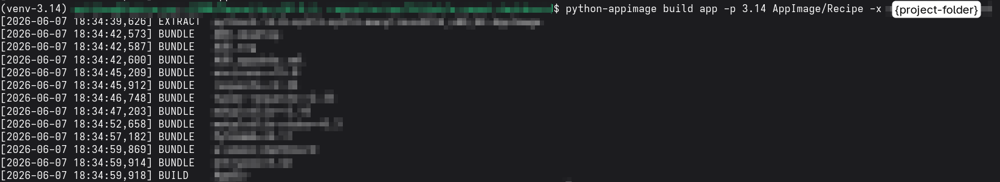

This project has been generated using ['A-Python-Template' (APT)](https://github.com/a-matthew/a-python-template).

## Metadata
Lots of information regarding AppImage building process and specifications can be found under the AppImage project's [GitHub Wiki](https://github.com/AppImage/AppImageKit/wiki)
- for AppImage recipes refer to: [Wiki/AppImages](https://github.com/AppImage/AppImageKit/wiki/AppImages) (not maintained)

A detailed comparison of `AppImage types` is available at the official [AppImageSpec](https://github.com/AppImage/AppImageSpec/blob/master/draft.md#appdir) repository.
- for `type1` (?) refer to: [AppImageKit](https://github.com/AppImage/AppImageKit)
- for `type2` refer to: [AppImageTool](https://github.com/AppImage/appimagetool)

## Setup
### Dependencies:
  - AppImage version: __type2__ <!--Type1--> <!--Type2-->
  - AppImage tool: [__python-appimage__](https://github.com/niess/python-appimage)

> 🚧
> `"The python-appimage utility can only package applications that can be installed directly with pip. For more advanced usage, it is necessary to extract and edit the Python AppImage."`

> 🚧
> `"Fuse is not supported on Windows Subsystem for Linux v1 (WSL1), which prevents the direct execution of AppImages. However, it is still possible to extract the contents of Python AppImages and use them, as explained in the Advanced installation section."`

### AppDir
AppDir directory description can be found at the AppImage project's [documentation](https://docs.appimage.org/reference/appdir.html).

The attached `python-appimage` (Python-based packaging tool) template contains:
- entrypoint.sh
- - it defines the main executable to run within the AppImage
- requirements.txt
- - it defines the (minimum) required packages to build AppImage with
- AUD.appdata.xml
  - this file can be generated with [AppStream generator](https://docs.appimage.org/packaging-guide/optional/appstream.html) from the AppImage's official documentation.  It defines the basic metadata.
- AUD.desktop
- - an AppImage integration details, keywords can be found at the official FreeDesktop's project [specification](https://specifications.freedesktop.org/desktop-entry/latest/recognized-keys.html)
- AUD.svg

#### AppImage Artifact
The final package can be extracted for debugging purposes using `./AUD-x86_64.AppImage --appimage-extract` command in the CLI.

The artifact's internal directory structure should resemble the following:
- AppRun
- - the entrypoint
- opt
- - Python dependencies
- other files
- - assets and other files

### Installation:
<!-- python-appimage -->
`python-appimage` based project examples may be found at [project's github](https://github.com/niess/python-appimage/tree/master/applications)

<!-- Venv -->
  - Windows
    - `cd "C:\Users\{User}\AppData\Local\Programs\Python\Launcher"`
    - `.\py.exe -3.14 -m venv "{path}/a-umami-dashboard/venv-3.14"` suggested
    - everything below
  - Linux
    - `python3.14 -m venv {path}/a-umami-dashboard/venv-3.14` suggested
    - everything below
  1. `cd {path}/a-umami-dashboard`
  2. `source venv-3.14/bin/activate`
  3. `pip install --upgrade pip`
  4. `pip install .`
  5. double check with `which python` (Linux)
  6. Update files in `AppImage/Recipe` directory
  7. Build with `python-appimage build app -p 3.14 AppImage/Recipe -x a-umami-dashboard`
  8. It is important that all dependencies of the app are within one folder. Best practices are covered by the AppImage project's [documentation](https://docs.appimage.org/reference/best-practices.html).

## Example
### CD Build
