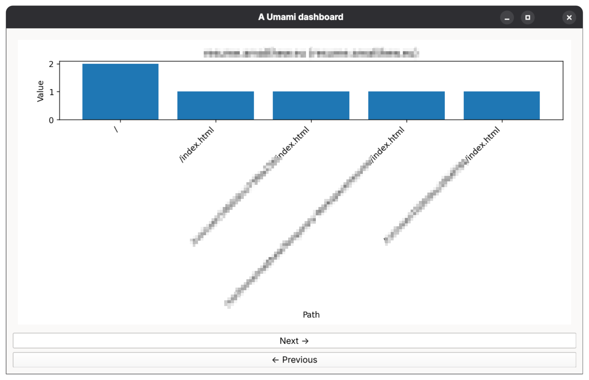

## Metadata
<!-- - Author: {author-profile-name}/{author-alias}. -->
- Name: 'a-umami-dashboard'.
- Purpose: Display (a) Umami dashboard.
- Format: CLI.
- License:
  - This project's license: [GNU General Public License v3.0](LICENSE)
  - PySide6: [GNU General Public License v3.0](https://www.qt.io/development/qt-framework/qt-licensing)
  <!-- - Dependency-1: [{dependency-name}({license-1-name})] -->
  <!-- - Dependency-2: [{dependency-name}({license-2-name})] -->

## Setup
### Dependencies:
  - Version: __3.14__
  - Manager: [__pip__](https://docs.python.org/3/installing/index.html)
  <!-- [__pip__](https://docs.python.org/3/installing/index.html) -->
  <!-- [__poetry__](https://github.com/python-poetry/poetry) -->
  <!-- [__uv__](https://github.com/astral-sh/uv) -->
  - Toolset:
    - [pyproject.toml](https://packaging.python.org/en/latest/guides/writing-pyproject-toml/)
    - [venv](https://docs.python.org/3/library/venv.html)
    - [pre-commit](https://github.com/pre-commit/pre-commit) (hooks)
        - [ruff](https://github.com/astral-sh/ruff)
        - [mypy](https://github.com/python/mypy)

### Installation:
<!-- Venv -->
  - Windows
    - `cd "C:\Users\{User}\AppData\Local\Programs\Python\Launcher"`
    - `.\py.exe -3.14 -m venv "{path}/a-umami-dashboard}/venv-3.14"` suggested
    - everything below
  - Linux
    - `python3.14 -m venv {path}/a-umami-dashboard}/venv-3.14` suggested
    - everything below
  1. `cd {path}/a-umami-dashboard}`
  2. `source venv-3.14/bin/activate`
  3. `pip install --upgrade pip`
  4. `pip install .`
  5. double check with `which python` (Linux)

### Usage:
  - project
    - `a-umami-dashboard/main.py`
      - configured using '.env' file
  - local tests
    - none
  - local CI
    - `pre-commit run --all-files`
    - - Files must be first added by `git add` for `pre-commit run` to detect.
    - - `pre-commit run` will install a .venv inside `~/.cache/pre-commit/`

## Example
### Page Metrics

